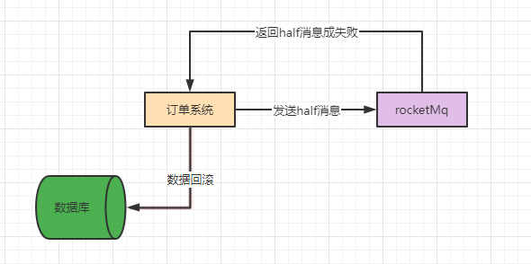

# 一、消息丢失的情况


## 1.消息发送失败

在生产者往broker中发送消息时，出现网抖动或网络故障，导致通讯失败，使得消息无法发送到broker中。


## 2.消息发送成功，broker消息存储消息失败

你的消息写入MQ之后，其实MQ可能仅仅是把这个消息给写入到page cache里，也就是操作系统自己管理的一个缓冲区，此时出现broker宕机，导致消息丢失。

再极端的情况下，消息落入磁盘，但是磁盘坏掉了。


## 3.消费者消息丢失

消费者提交了消费的offset，但是业务处理还未处理完，消费者宕机，导致消费的offset已经提交，但是业务处理并未走完。


# 二、消息可靠性投递方案

## 1.解决消息推送丢失——事务消息

### 1.1发送half消息


消费者先发一个half消息给MQ以及收到他的成功的响应，初步先跟MQ做个联系和沟通。大概这个意思就是说，确认一下MQ还活着，MQ也知道你后续可能想发送一条很关键的不希望丢失的消息。

**所谓的half消息实际就是订单支付成功的消息，只不过他的状态是half。也就是他是half状态的时候，其他消费服务是看不见他的，没法获取到这条消息，必须等到订单系统执行commit请求，消息被commit之后，红包系统才可以看到和获取这条消息进行后续处理。**

- **half消息写入失败（收到失败响应）**

half消息发送失败可能MQ就挂了，或者这个时候网络就是故障了，所以导致你的half消息都没发送成功，总之你现在肯定没法跟MQ通信了，消费者需要根据自身的业务做一些处理，例如事务回滚之类的。



- **half消息写入成功（收到成功响应）**

half消息写入成功，则执行一些业务逻辑，例如更新订单数据


此时如果更新订单数据失败，则需发送rollback请求，删除mq中的half消息。


- **未收到响应**

如果我们把half消息发送给MQ了，MQ给保存下来了，但是MQ返回给我们的响应我们没收到呢？此时会发生什么事情？这个时候我们没收到响应，可能就会网络超时报错，也可能直接有其他的异常错误，这个时候订单系统会误以为是发送half消息到MQ失败了。接下来的逻辑则与收到失败响应一致，进行事务回滚。

但这时half消息已经存储在rocketmq中了，消息该如何处理：

RocketMQ这里有一个补偿流程，他会去扫描自己处于half状态的消息，如果我们一直没有对这个消息执行commit/rollback操作，超过了一定的时间，他就会回调你的订单系统的一个接口，去查看这条消息是怎么回，应该怎么处理。

例如会查询订单的状态，查询到订单已关闭，则直接删除该条half消息即可。若查询到改订单已经确认，则直接提交该条half消息。

### 1.2发送commit消息

当本地一些业务事务执行成功后，生产者发送一条commit消息给mq，mq对这条half消息进commit操作，commit后，消费者就能看到该条消息。


### 1.3补偿机制

如果commit或者rollback失败呢？此时还是会触发rocketmq的补偿机制，询问业务系统结果，根据结果对消息进行删除或者commit。

如果订单系统收到了half消息写入成功的响应了，同时尝试对自己的数据库更新了，然后根据失败或者成功去执行了rollback或者commit请求，发送给MQ了。很不巧，mq在这个时候挂掉了，导致rollback或者commit请求发送失败，怎么办？

如果是这种情况的话，那就等mq自己重启了，重启之后他会扫描half消息，然后还是通过上面说到的补偿机制，去回调你的接口。


### 1.4事务消息的原理

- **half消息原理及发送**

发送half消息后，后将消息写入broker中的commitLog文件，但是broker发现这是条half消息后，不会将消息的offset写入consumerqueue中，二是写入到内部一个topic为“**RMQ_SYS_TRANS_HALF_TOPIC**”的ConsunerQueue中，因此你的消费服务肯定是取不到相关消息的。


- **half消息成功响应**

half消息进入到RocketMQ内部的RMQ_SYS_TRANS_HALF_TOPIC的ConsumeQueue文件中，此时就会认为half消息写入成功了，然后就会返回响应给订单系统。所以这个时候，一旦你的订单系统收到这个half消息写入成功的响应，必然就知道这个half消息已经在RocketMQ内部了。


- **补偿机制原理**

在后台有定时任务，定时任务会去扫描RMQ_SYS_TRANS_HALF_TOPIC中的half消息，如果你超过一定时间还是half消息，他会回调订单系统的接口，让你判断这个half消息是要rollback还是commit。


- **消息回滚消息回滚**

消息回滚并不会去删除commitlog中的消息，因为RocketMQ都是顺序把消息写入磁盘文件的，所以在这里如果你执行rollback，他的本质就是用一个OP操作来标记half消息的状态，标记为rollback。

- **消息commit**

你执行commit操作之后，RocketMQ就会在OP_TOPIC里写入一条记录，标记half消息已经是commit状态了。接着需要把放在RMQ_SYS_TRANS_HALF_TOPIC中的half消息给写入到OrderPaySuccessTopic的ConsumeQueue里去，然后我们的消费系统可以就可以看到这条消息进行消费了。


## 2.解决mq自身丢失消息

### 2.1同步刷盘

将刷盘模式改为同步刷盘，改为同步刷盘后，写入MQ的每条消息，只要MQ告诉我们写入成功了，那么他们就是已经进入了磁盘文件了。

### 2.2主从架构避免磁盘故障

必须让一个Master Broker有一个Slave Broker去同步他的数据，而且你一条消息写入成功，必须是让Slave Broker也写入成功，保证数据有多个副本的冗余。你一条消息但凡写入成功了，此时主从两个Broker上都有这条数据了，此时如果你的Master Broker的磁盘坏了，但是lave Broker上至少还是有数据的，数据是不会因为磁盘故障而丢失的。

## 3.解决消费者消息丢失——**手动提交offset + 自动故障转移**

RocketMQ的消费者中会注册一个监听器，就是上面小块代码中的MessageListenerConcurrently这个东西，当你的消费者获取到一批消息之后，就会回调你的这个监听器函数，让你来处理这一批消息。

然后当你处理完毕之后，你才会返ConsumeConcurrentlyStatus.CONSUME_SUCCESS作为消费成功的示意，告诉RocketMQ，这批消息我已经处理完毕了。

如果是红包系统获取到一批消息之后，还没处理完，也就没返回ConsumeConcurrentlyStatus.CONSUME_SUCCESS这个状态呢，自然没提交这批消息的offset给broker呢，此时消费系统突然挂了，会怎么样？

其实在这种情况下，你对一批消息都没提交他的offset给broker的话，broker不会认为你已经处理完了这批消息，此时你突然消费系统的一台机器宕机了，他其实会感知到你的红包系统的一台机器作为一个Consumer挂了。

接着他会把你没处理完的那批消息交给红包系统的其他机器去进行处理，所以在这种情况下，消息也绝对是不会丢失的


# 三、总结

## 1.发送消息到MQ的零丢失

- 方案一：同步发送消息 + 反复多次重试

- 方案二：事务消息机制

两者都有保证消息发送零丢失的效果，但事务消息方案整体会更好一些。

## 2.MQ收到消息之后的零丢失

- 开启同步刷盘策略

- 主从架构同步机制，只要让一个Broker收到消息之后同步写入磁盘，同时同步复制给其他Broker，然后再返回响应给生产者说写入成功，此时就可以保证MQ自己不会弄丢消息

## 3.消费消息的零丢失

** 手动提交offset + 自动故障转移：** 采用RocketMQ的消费者天然就可以保证你处理完消息之后，才会提交消息的offset到broker去。
# 四、代码示例-可靠消息最终一致性
## 1.背景
模拟用户下单操作，用户下单前进行优惠券及库存扣减后完成订单创建。订单支付完成后进行积分发放及消息通知。


## 2.详细流程
### 2.1 订单确认流程

**（1）下单失败库存、优惠券回滚**

订单创建前已经完成库存及优惠券的扣减，此时订单创建失败需进行库存及优惠券数据的回滚。此时向mq中发送订单创建失败消息，由库存及优惠券消费者监听消息消费，完成库存及优惠券的回滚。
- 订单确认逻辑
```java
private Order confirmOrder() throws MQBrokerException, RemotingException, InterruptedException, MQClientException {
        Order order = orderServer.initialize();
        try {
            //2.库存扣减
            goodsServer.reduceGood(order);
            //3.优惠券扣减
            couponServer.useCoupon(order);
            //int x = 1/0 ;
            //4.生成订单
            order = orderServer.creatOrder(order);
            //5.订单生成成功

            //6.发送延时消息
            messageServer.sendOrderDelayMessage(order);
            log.info("{}订单确认成功",order.getId());
        } catch (Exception e) {
            log.error("订单：{}生成失败，发送取消消息",order.getId());
            //生成订单失败，发送回退消息，库存服务及优惠券服务进行回退
            messageServer.sendOrderCancelMessage(order);
        }
        return order;
    }
    /**
     * 发送订单取消消息
     * @param order
     */
    public void sendOrderCancelMessage(Order order) throws MQBrokerException, RemotingException, InterruptedException, MQClientException {
        Message message = new Message(cancelTopic,"",order.getId(),JSON.toJSONString(order).getBytes(StandardCharsets.UTF_8));
        rocketMQTemplate.getProducer().send(message);
        }
```
- 消息监听及优惠券回退
```java
@Slf4j
@Component
@RocketMQMessageListener(topic = "${mq.order.topic.cancel}",consumerGroup = "${mq.order.consumer.group.coupon}",messageModel = MessageModel.CLUSTERING )
public class OrderCancelCouponListener implements RocketMQListener<MessageExt> {
    @Autowired
    private CouponServer couponServer ;
    @Override
    public void onMessage(MessageExt messageExt) {
        try{
            //1. 解析消息内容
            String msgId = messageExt.getMsgId();
            log.info("收到订单取消消息{}",msgId);
            String body = new String(messageExt.getBody(), "UTF-8");
            Order order = JSON.parseObject(body, Order.class);
            couponServer.rollBack(order);
        } catch (UnsupportedEncodingException e) {
            e.printStackTrace();
        }
    }
}
```
- 消息监听及库存回退
```java
@Slf4j
@Component
@RocketMQMessageListener(topic = "${mq.order.topic.cancel}",consumerGroup = "${mq.order.consumer.group.goods}",messageModel = MessageModel.CLUSTERING )
public class OrderCancelGoodsListener implements RocketMQListener<MessageExt> {
    @Autowired
    private GoodsServer goodsServer ;
    @Override
    public void onMessage(MessageExt messageExt) {
        try {
            //1. 解析消息内容
            String msgId = messageExt.getMsgId();
            log.info("收到订单取消消息{}",msgId);
            String body = new String(messageExt.getBody(), "UTF-8");
            Order order = JSON.parseObject(body, Order.class);
            goodsServer.rollBack(order);
        } catch (UnsupportedEncodingException e) {
            e.printStackTrace();
        }
    }
}
```
**（2）订单下单成功发送订单延时消息**
- 订单确认成功后，发送延时消息，用于处理订单超时未支付过期问题。
```java
   //6.发送延时消息
    messageServer.sendOrderDelayMessage(order);

    /**
     * 发送订单创建成功延时消息
     * @param order
     */
    public void sendOrderDelayMessage(Order order) throws MQBrokerException, RemotingException, InterruptedException, MQClientException {
        Message message = new Message(delayTopic,"",order.getId(),JSON.toJSONString(order).getBytes(StandardCharsets.UTF_8));
        message.setDelayTimeLevel(10);
        rocketMQTemplate.getProducer().send(message);
        }
```
- 延时消息监听-处理优惠券
```java
    @Slf4j
    @Component
    @RocketMQMessageListener(topic = "${mq.order.topic.delay}",consumerGroup = "${mq.order.consumer.group.delay.coupon}",messageModel = MessageModel.CLUSTERING )
    public class OrderTimeoutCouponListener implements RocketMQListener<MessageExt> {
        @Autowired
        private CouponServer couponServer ;
        @SneakyThrows
        @Override
        public void onMessage(MessageExt messageExt) {
            String msgId = messageExt.getMsgId();
            log.info("收到订单延时取消消息{}",msgId);
            String body = new String(messageExt.getBody(), "UTF-8");
            Order order = JSON.parseObject(body, Order.class);
            couponServer.delayOrder(order);
        }
    }
    //判断订单是否已经处理
    public void delayOrder(Order order) {
        Order orderInfo = orderServer.getOrder(order.getId());
        if(orderInfo.getOrderStatus()!=2){
            this.rollBack(order);
        }else {
            log.info("订单{}已成功完成支付",orderInfo.getId());
        }
    }
```
- 延时消息监听-处理库存
```java
    @Component
    @Slf4j
    @RocketMQMessageListener(topic = "${mq.order.topic.delay}",consumerGroup = "${mq.order.consumer.group.delay.goods}",messageModel = MessageModel.CLUSTERING )
    public class OrderTimeoutGoodsListener implements RocketMQListener<MessageExt> {
        @Autowired
        private GoodsServer goodsServer;
        @SneakyThrows
        @Override
        public void onMessage(MessageExt messageExt) {
            String msgId = messageExt.getMsgId();
            log.info("收到订单延时取消消息{}",msgId);
            String body = new String(messageExt.getBody(), "UTF-8");
            Order order = JSON.parseObject(body, Order.class);
            goodsServer.orderDelay(order);
        }
    }
    /**
     *
     * @param order
     */
    public void orderDelay(Order order) {
        Order orderInfo = orderServer.getOrder(order.getId());
        if(orderInfo.getOrderStatus()!=2){
            this.rollBack(order);
        }else {
            log.info("订单{}已成功完成支付",orderInfo.getId());
        }
    }
```
### 2.2 订单支付流程
订单支付引入了rocketMq的事务消息，用于确保消息能够投递到mq中。

- half消息发送
```java
    @PostMapping("/payOrder")
    private void payOrder(String orderId) {
        Order order = orderServer.getOrder(orderId);
        try {
            if(order!=null){
                //1.支付订单
                payServer.payOrder(order);
                //2.订单成功发送消息
                messageServer.sendOrderPaySuccessTransMessage(order);
            }
        }catch (Exception e){
            //支付失败
        }
    }
    /**
     * 发送订单支付成功消息
     * @param order
     */
    public boolean sendOrderPaySuccessTransMessage(Order order) throws MQClientException {
        Message message = new Message(successTopic,"",order.getId(),JSON.toJSONString(order).getBytes(StandardCharsets.UTF_8));
        TransactionSendResult sendResult = rocketMQTemplate.getProducer().sendMessageInTransaction(message, "orderPayMessage");
        String sendStatus = sendResult.getSendStatus().name();
        String localTXState = sendResult.getLocalTransactionState().name();
        log.info(" send status={},localTransactionState={} ",sendStatus,localTXState);
        return Boolean.TRUE;
        }
```
- 事务消息回查及本地事务执行
```java
@Slf4j
@Component
@RocketMQTransactionListener
public class OrderTXMsgListener implements RocketMQLocalTransactionListener {
    private PayServer payServer ;
    private OrderServer orderServer ;
    @Autowired
    public OrderTXMsgListener(PayServer payServer, OrderServer orderServer) {
        this.payServer = payServer;
        this.orderServer = orderServer;
    }

    // 执行本地事务
    @Override
    public RocketMQLocalTransactionState executeLocalTransaction(Message message, Object arg) {
        log.info(" TX message listener execute local transaction, message={},args={} ",message,arg);
        // 执行本地事务
        RocketMQLocalTransactionState result = RocketMQLocalTransactionState.COMMIT;
        try {
            String jsonString = new String((byte[]) message.getPayload());
            Order order = JSON.parseObject(jsonString, Order.class);
            //执行交费代码
            boolean paySuccess = payServer.payOrder(order);
            if(!paySuccess){
                result = RocketMQLocalTransactionState.UNKNOWN;
            }
        } catch (Exception e) {
            log.error(" exception message={} ",e.getMessage());
            result = RocketMQLocalTransactionState.UNKNOWN;
        }
        return result;
    }
    // 检查本地事务
    @Override
    public RocketMQLocalTransactionState checkLocalTransaction(Message message) {
        log.info(" TX message listener check local transaction, message={} ",message.getPayload());
        RocketMQLocalTransactionState result = RocketMQLocalTransactionState.COMMIT;
        try {
          //检查本地事务
            String jsonString = new String((byte[]) message.getPayload());
            Order order = JSON.parseObject(jsonString, Order.class);
            Order orderInfo = orderServer.getOrder(order.getId());
            if(orderInfo == null ||orderInfo.getOrderStatus() != 2){
                result = RocketMQLocalTransactionState.ROLLBACK;
            }
        } catch (Exception e) {
            // 异常就回滚
            log.error(" exception message={} ",e.getMessage());
            result = RocketMQLocalTransactionState.ROLLBACK;
        }
        return result;
    }
}
```
- 消息消费-支付通知
```java
@Slf4j
@Component
@RocketMQMessageListener(topic = "${mq.order.topic.success}",consumerGroup = "${mq.order.consumer.group.notice}",messageModel = MessageModel.CLUSTERING )
public class PaySuccessNoticeListener implements RocketMQListener<MessageExt> {
    @Autowired
    private NoticeServer noticeServer ;
    @SneakyThrows
    @Override
    public void onMessage(MessageExt messageExt) {
        String msgId = messageExt.getMsgId();
        log.info("收到订单支付成功消息{}",msgId);
        String body = new String(messageExt.getBody(), "UTF-8");
        Order order = JSON.parseObject(body, Order.class);
        noticeServer.sendNotice(order);
    }
}
```
- 消息消费-积分发放
```java
@Slf4j
@Component
@RocketMQMessageListener(topic = "${mq.order.topic.success}",consumerGroup = "${mq.order.consumer.group.point}",messageModel = MessageModel.CLUSTERING )
public class PaySuccessPointListener implements RocketMQListener<MessageExt> {
    AtomicInteger atomicInteger = new AtomicInteger(0);
    @Autowired
    private PointServer pointServer ;
    @SneakyThrows
    @Override
    public void onMessage(MessageExt messageExt) {
        String msgId = messageExt.getMsgId();
        log.info("收到订单支付成功消息{}",msgId);
        String body = new String(messageExt.getBody(), "UTF-8");
        Order order = JSON.parseObject(body, Order.class);
        try {
            log.info("积分消费者消费消息!");

            //int x = 1/atomicInteger.getAndIncrement()-1 ; 异常处理
            pointServer.distribute(order);
        }catch (Exception e){
            //抛出异常后，MQClient会返回ConsumeConcurrentlyStatus.RECONSUME_LATER进行重试，
            throw e;
        }
    }
}
```
## 3.执行结果校验
### 3.1增加线程池
增加定时任务线程池，打印当前库存及优惠券。
```java
@Component
public class ApplicationRunnerImpl implements ApplicationRunner {
    @Autowired
    private CouponServer couponServer ;
    @Autowired
    private GoodsServer goodsServer ;
    private final ScheduledExecutorService scheduledExecutorService
            = Executors.newSingleThreadScheduledExecutor(new ThreadFactoryImpl("OrderScheduledThread"));
    @Override
    public void run(ApplicationArguments args) throws Exception {
        this.scheduledExecutorService.scheduleAtFixedRate(new Runnable() {
            @Override
            public void run() {
                couponServer.couponCount();
                goodsServer.goodsCount();
            }
        }, 20, 20, TimeUnit.SECONDS);
    }
}

public class ThreadFactoryImpl implements ThreadFactory {
    private final AtomicLong threadIndex = new AtomicLong(0);
    private final String threadNamePrefix;
    private final boolean daemon;

    public ThreadFactoryImpl(String threadNamePrefix) {
        this(threadNamePrefix,false);
    }

    public ThreadFactoryImpl(String threadNamePrefix, boolean daemon) {
        this.threadNamePrefix = threadNamePrefix;
        this.daemon = daemon;
    }
    @Override
    public Thread newThread(Runnable r) {
        Thread thread = new Thread(r, threadNamePrefix + "["+this.threadIndex.incrementAndGet()+"]");
        thread.setDaemon(daemon);
        return thread;
    }
}
```
## 3.2 订单确认
- 库存及优惠券回退(创建定点订单时异常)
```vertica
OrderScheduledThread[1]当前剩余优惠券数量为：3，优惠券列表：[1, 2, 3]                              
OrderScheduledThread[1]当前库存为：100                                                 
库存扣减完成！                                                                          
优惠券扣减完成！                                                                         
OrderScheduledThread[1]当前剩余优惠券数量为：2，优惠券列表：[2, 3]                                 
OrderScheduledThread[1]当前库存为：95                                                  
订单：019c20b6f87640d58bf2b3d9ef61c08d生成失败，发送取消消息                                   
收到订单取消消息0A017084416857FA26B727A7E65C0000                                         
收到订单取消消息0A017084416857FA26B727A7E65C0000                                         
商品库存回退成功                                                                         
优惠券回退成功！                                                                         
OrderScheduledThread[1]当前剩余优惠券数量为：3，优惠券列表：[2, 3, 1]                              
OrderScheduledThread[1]当前库存为：100                                                 
```
- 延时消息库存订单取消（订单超时）
```vertica
2021-12-08 16:52:06.729  INFO 20320 --- [eduledThread[1]] com.message.server.CouponServer          : OrderScheduledThread[1]当前剩余优惠券数量为：3，优惠券列表：[1, 2, 3]
2021-12-08 16:52:06.729  INFO 20320 --- [eduledThread[1]] com.message.server.GoodsServer           : OrderScheduledThread[1]当前库存为：100
2021-12-08 16:52:22.744  INFO 20320 --- [nio-8888-exec-4] com.message.server.GoodsServer           : 库存扣减完成！
2021-12-08 16:52:22.744  INFO 20320 --- [nio-8888-exec-4] com.message.server.CouponServer          : 优惠券扣减完成！
2021-12-08 16:52:22.999  INFO 20320 --- [nio-8888-exec-4] com.message.provider.ShopController      : 1e1a4bd8aae947e7a6192485ba2b88d7订单确认成功
2021-12-08 16:52:26.736  INFO 20320 --- [eduledThread[1]] com.message.server.CouponServer          : OrderScheduledThread[1]当前剩余优惠券数量为：2，优惠券列表：[2, 3]
2021-12-08 16:52:26.737  INFO 20320 --- [eduledThread[1]] com.message.server.GoodsServer           : OrderScheduledThread[1]当前库存为：95
2021-12-08 16:52:46.724  INFO 20320 --- [eduledThread[1]] com.message.server.CouponServer          : OrderScheduledThread[1]当前剩余优惠券数量为：2，优惠券列表：[2, 3]
2021-12-08 16:52:46.724  INFO 20320 --- [eduledThread[1]] com.message.server.GoodsServer           : OrderScheduledThread[1]当前库存为：95
2021-12-08 16:53:06.727  INFO 20320 --- [eduledThread[1]] com.message.server.CouponServer          : OrderScheduledThread[1]当前剩余优惠券数量为：2，优惠券列表：[2, 3]
2021-12-08 16:53:06.727  INFO 20320 --- [eduledThread[1]] com.message.server.GoodsServer           : OrderScheduledThread[1]当前库存为：95
2021-12-08 16:53:23.009  INFO 20320 --- [MessageThread_1] c.m.m.l.OrderTimeoutGoodsListener        : 收到订单延时取消消息0A0170844F6057FA26B727AB60D10000，取消订单
2021-12-08 16:53:23.009  INFO 20320 --- [MessageThread_1] c.m.m.l.OrderTimeoutCouponListener       : 收到订单延时取消消息0A0170844F6057FA26B727AB60D10000，取消订单
2021-12-08 16:53:23.014  INFO 20320 --- [MessageThread_1] com.message.server.CouponServer          : 优惠券回退成功！
2021-12-08 16:53:23.014  INFO 20320 --- [MessageThread_1] com.message.server.GoodsServer           : 商品库存回退成功
2021-12-08 16:53:26.724  INFO 20320 --- [eduledThread[1]] com.message.server.CouponServer          : OrderScheduledThread[1]当前剩余优惠券数量为：3，优惠券列表：[2, 3, 1]
2021-12-08 16:53:26.724  INFO 20320 --- [eduledThread[1]] com.message.server.GoodsServer           : OrderScheduledThread[1]当前库存为：100
```
- 事务消息正常处理（无异常）
```vertica
2021-12-08 17:00:06.148  INFO 20320 --- [nio-8888-exec-8] com.message.server.PayServer             : 订单1c6c9f90210b4ff8a353b9cedf226701支付成功
2021-12-08 17:00:06.162  INFO 20320 --- [nio-8888-exec-8] c.m.mq.listener.OrderTXMsgListener       :  TX message listener execute local transaction, message=GenericMessage [payload=byte[116], headers={rocketmq_KEYS=1c6c9f90210b4ff8a353b9cedf226701, rocketmq_TOPIC=PAY_SUCCESS_TOPIC, rocketmq_FLAG=0, id=1316b902-4857-17cb-429a-3a5f63970298, rocketmq_TRANSACTION_ID=0A0170844F6057FA26B727B27284000C, timestamp=1638954006161}],args=orderPayMessage 
2021-12-08 17:00:06.162  INFO 20320 --- [nio-8888-exec-8] com.message.server.PayServer             : 订单1c6c9f90210b4ff8a353b9cedf226701支付成功
2021-12-08 17:00:06.164  INFO 20320 --- [nio-8888-exec-8] com.message.mq.message.MessageServer     :  send status=SEND_OK,localTransactionState=COMMIT_MESSAGE 
2021-12-08 17:00:06.178  INFO 20320 --- [MessageThread_1] c.m.m.listener.PaySuccessNoticeListener  : 收到订单支付成功消息0A0170844F6057FA26B727B27284000C
2021-12-08 17:00:06.178  INFO 20320 --- [MessageThread_1] c.m.mq.listener.PaySuccessPointListener  : 收到订单支付成功消息0A0170844F6057FA26B727B27284000C
2021-12-08 17:00:06.178  INFO 20320 --- [MessageThread_1] c.m.mq.listener.PaySuccessPointListener  : 积分消费者消费消息!
2021-12-08 17:00:06.178  INFO 20320 --- [MessageThread_1] com.message.server.NoticeServer          : 1c6c9f90210b4ff8a353b9cedf226701订单支付成功，发送消息！
2021-12-08 17:00:06.178  INFO 20320 --- [MessageThread_1] com.message.server.PointServer           : 1c6c9f90210b4ff8a353b9cedf226701订单获得积分
2021-12-08 17:00:06.734  INFO 20320 --- [eduledThread[1]] com.message.server.CouponServer          : OrderScheduledThread[1]当前剩余优惠券数量为：2，优惠券列表：[2, 3]
2021-12-08 17:00:06.734  INFO 20320 --- [eduledThread[1]] com.message.server.GoodsServer           : OrderScheduledThread[1]当前库存为：95
```
- 本地事务执行失败(执行本地事务时返回RocketMQLocalTransactionState.ROLLBACK状态)
```vertica
2021-12-08 17:05:33.692  INFO 19800 --- [eduledThread[1]] com.message.server.CouponServer          : OrderScheduledThread[1]当前剩余优惠券数量为：2，优惠券列表：[2, 3]
2021-12-08 17:05:33.692  INFO 19800 --- [eduledThread[1]] com.message.server.GoodsServer           : OrderScheduledThread[1]当前库存为：95
2021-12-08 17:05:37.386  INFO 19800 --- [nio-8888-exec-9] com.message.server.PayServer             : 订单501b3682e9c04c9ba765625f0e6212aa支付成功
2021-12-08 17:05:43.880  INFO 19800 --- [nio-8888-exec-9] c.m.mq.listener.OrderTXMsgListener       :  TX message listener execute local transaction, message=GenericMessage [payload=byte[116], headers={rocketmq_KEYS=501b3682e9c04c9ba765625f0e6212aa, rocketmq_TOPIC=PAY_SUCCESS_TOPIC, rocketmq_FLAG=0, id=3c961c5f-8e8d-54e6-4006-96585d1daa0a, rocketmq_TRANSACTION_ID=0A0170844D5857FA26B727B79687001E, timestamp=1638954343053}],args=orderPayMessage 
2021-12-08 17:05:46.636  INFO 19800 --- [nio-8888-exec-9] com.message.server.PayServer             : 订单501b3682e9c04c9ba765625f0e6212aa支付成功
2021-12-08 17:05:49.569 ERROR 19800 --- [nio-8888-exec-9] c.m.mq.listener.OrderTXMsgListener       :  exception message=/ by zero 
2021-12-08 17:05:53.978  INFO 19800 --- [eduledThread[1]] com.message.server.CouponServer          : OrderScheduledThread[1]当前剩余优惠券数量为：2，优惠券列表：[2, 3]
2021-12-08 17:05:53.979  INFO 19800 --- [eduledThread[1]] com.message.server.GoodsServer           : OrderScheduledThread[1]当前库存为：95
2021-12-08 17:05:53.981  INFO 19800 --- [nio-8888-exec-9] com.message.mq.message.MessageServer     :  send status=SEND_OK,localTransactionState=ROLLBACK_MESSAGE 

```
- 本地事务回查（执行本地事务时返回RocketMQLocalTransactionState.UNKNOWN状态及重试）
```vertica
2021-12-08 17:20:57.861  INFO 18224 --- [nio-8888-exec-4] com.message.server.PayServer             : 订单388f56beb04e4b9cb5ecf73e7d5c3272支付成功
2021-12-08 17:20:57.867  INFO 18224 --- [nio-8888-exec-4] c.m.mq.listener.OrderTXMsgListener       :  TX message listener execute local transaction, message=GenericMessage [payload=byte[116], headers={rocketmq_KEYS=388f56beb04e4b9cb5ecf73e7d5c3272, rocketmq_TOPIC=PAY_SUCCESS_TOPIC, rocketmq_FLAG=0, id=1826db7f-4850-1362-c91d-d82c06d88ee8, rocketmq_TRANSACTION_ID=0A017084473057FA26B727C58C050003, timestamp=1638955257866}],args=orderPayMessage 
2021-12-08 17:20:57.869  INFO 18224 --- [nio-8888-exec-4] com.message.server.PayServer             : 订单388f56beb04e4b9cb5ecf73e7d5c3272支付成功
2021-12-08 17:20:57.869 ERROR 18224 --- [nio-8888-exec-4] c.m.mq.listener.OrderTXMsgListener       :  exception message=/ by zero 
2021-12-08 17:20:57.870  INFO 18224 --- [nio-8888-exec-4] com.message.mq.message.MessageServer     :  send status=SEND_OK,localTransactionState=UNKNOW 
2021-12-08 17:21:12.404  INFO 18224 --- [eduledThread[1]] com.message.server.CouponServer          : OrderScheduledThread[1]当前剩余优惠券数量为：2，优惠券列表：[2, 3]
2021-12-08 17:21:12.404  INFO 18224 --- [eduledThread[1]] com.message.server.GoodsServer           : OrderScheduledThread[1]当前库存为：95
2021-12-08 17:21:32.409  INFO 18224 --- [eduledThread[1]] com.message.server.CouponServer          : OrderScheduledThread[1]当前剩余优惠券数量为：2，优惠券列表：[2, 3]
2021-12-08 17:21:52.412  INFO 18224 --- [eduledThread[1]] com.message.server.GoodsServer           : OrderScheduledThread[1]当前库存为：95
2021-12-08 17:21:55.949  INFO 18224 --- [pool-3-thread-1] c.m.mq.listener.OrderTXMsgListener       :  TX message listener check local transaction, message=[123, 34, 99, 111, 117, 112, 111, 110, 73, 100, 34, 58, 34, 49, 34, 44, 34, 105, 100, 34, 58, 34, 51, 56, 56, 102, 53, 54, 98, 101, 98, 48, 52, 101, 52, 98, 57, 99, 98, 53, 101, 99, 102, 55, 51, 101, 55, 100, 53, 99, 51, 50, 55, 50, 34, 44, 34, 110, 117, 109, 34, 58, 53, 44, 34, 111, 114, 100, 101, 114, 65, 109, 111, 117, 110, 116, 34, 58, 49, 48, 48, 57, 44, 34, 111, 114, 100, 101, 114, 83, 116, 97, 116, 117, 115, 34, 58, 50, 44, 34, 117, 115, 101, 114, 73, 100, 34, 58, 34, 48, 48, 48, 48, 49, 34, 125] 
2021-12-08 17:21:55.969  INFO 18224 --- [MessageThread_1] c.m.mq.listener.PaySuccessPointListener  : 收到订单支付成功消息0A017084473057FA26B727C58C050003
2021-12-08 17:21:55.969  INFO 18224 --- [MessageThread_1] c.m.m.listener.PaySuccessNoticeListener  : 收到订单支付成功消息0A017084473057FA26B727C58C050003
2021-12-08 17:21:55.970  INFO 18224 --- [MessageThread_1] com.message.server.NoticeServer          : 388f56beb04e4b9cb5ecf73e7d5c3272订单支付成功，发送消息！
2021-12-08 17:21:55.970  INFO 18224 --- [MessageThread_1] c.m.mq.listener.PaySuccessPointListener  : 积分消费者消费消息!
2021-12-08 17:21:55.970  INFO 18224 --- [MessageThread_1] com.message.server.PointServer           : 388f56beb04e4b9cb5ecf73e7d5c3272订单获得积分
```
- 消费者消费重试（抛出异常后，MQClient会返回ConsumeConcurrentlyStatus.RECONSUME_LATER进行重试）
```vertica
2021-12-08 17:27:54.536  INFO 20528 --- [nio-8888-exec-3] com.message.server.GoodsServer           : 库存扣减完成！
2021-12-08 17:27:54.536  INFO 20528 --- [nio-8888-exec-3] com.message.server.CouponServer          : 优惠券扣减完成！
2021-12-08 17:27:54.783  INFO 20528 --- [nio-8888-exec-3] com.message.provider.ShopController      : 23350f08ca044b1cae2adbf9ff5f37b6订单确认成功
2021-12-08 17:27:58.313  INFO 20528 --- [nio-8888-exec-5] com.message.server.PayServer             : 订单23350f08ca044b1cae2adbf9ff5f37b6支付成功
2021-12-08 17:27:58.324  INFO 20528 --- [nio-8888-exec-5] c.m.mq.listener.OrderTXMsgListener       :  TX message listener execute local transaction, message=GenericMessage [payload=byte[116], headers={rocketmq_KEYS=23350f08ca044b1cae2adbf9ff5f37b6, rocketmq_TOPIC=PAY_SUCCESS_TOPIC, rocketmq_FLAG=0, id=a76f8ec7-9a85-d29b-ef04-d92b1785f3bc, rocketmq_TRANSACTION_ID=0A017084503057FA26B727CBF66A0003, timestamp=1638955678324}],args=orderPayMessage 
2021-12-08 17:27:58.327  INFO 20528 --- [nio-8888-exec-5] com.message.server.PayServer             : 订单23350f08ca044b1cae2adbf9ff5f37b6支付成功
2021-12-08 17:27:58.328  INFO 20528 --- [nio-8888-exec-5] com.message.mq.message.MessageServer     :  send status=SEND_OK,localTransactionState=COMMIT_MESSAGE 
2021-12-08 17:27:58.337  INFO 20528 --- [MessageThread_1] c.m.mq.listener.PaySuccessPointListener  : 收到订单支付成功消息0A017084503057FA26B727CBF66A0003
2021-12-08 17:27:58.337  INFO 20528 --- [MessageThread_1] c.m.m.listener.PaySuccessNoticeListener  : 收到订单支付成功消息0A017084503057FA26B727CBF66A0003
2021-12-08 17:27:58.337  INFO 20528 --- [MessageThread_1] c.m.mq.listener.PaySuccessPointListener  : 积分消费者消费消息!
2021-12-08 17:27:58.337  INFO 20528 --- [MessageThread_1] com.message.server.NoticeServer          : 23350f08ca044b1cae2adbf9ff5f37b6订单支付成功，发送消息！
2021-12-08 17:27:58.340  WARN 20528 --- [MessageThread_1] a.r.s.s.DefaultRocketMQListenerContainer : consume message failed. messageExt:MessageExt [brokerName=broker-a, queueId=3, storeSize=384, queueOffset=4, sysFlag=8, bornTimestamp=1638955678314, bornHost=/10.1.112.132:52289, storeTimestamp=1638955676526, storeHost=/10.1.60.210:10911, msgId=0A013CD200002A9F0000000000093EB3, commitLogOffset=605875, bodyCRC=1470889837, reconsumeTimes=0, preparedTransactionOffset=605484, toString()=Message{topic='PAY_SUCCESS_TOPIC', flag=0, properties={MIN_OFFSET=0, REAL_TOPIC=PAY_SUCCESS_TOPIC, MAX_OFFSET=5, KEYS=23350f08ca044b1cae2adbf9ff5f37b6, TRAN_MSG=true, CONSUME_START_TIME=1638955678336, UNIQ_KEY=0A017084503057FA26B727CBF66A0003, WAIT=true, PGROUP=my-group, REAL_QID=3}, body=[123, 34, 99, 111, 117, 112, 111, 110, 73, 100, 34, 58, 34, 49, 34, 44, 34, 105, 100, 34, 58, 34, 50, 51, 51, 53, 48, 102, 48, 56, 99, 97, 48, 52, 52, 98, 49, 99, 97, 101, 50, 97, 100, 98, 102, 57, 102, 102, 53, 102, 51, 55, 98, 54, 34, 44, 34, 110, 117, 109, 34, 58, 53, 44, 34, 111, 114, 100, 101, 114, 65, 109, 111, 117, 110, 116, 34, 58, 49, 48, 48, 57, 44, 34, 111, 114, 100, 101, 114, 83, 116, 97, 116, 117, 115, 34, 58, 50, 44, 34, 117, 115, 101, 114, 73, 100, 34, 58, 34, 48, 48, 48, 48, 49, 34, 125], transactionId='0A017084503057FA26B727CBF66A0003'}], error:{}
java.lang.ArithmeticException: / by zero
2021-12-08 17:28:08.348  INFO 20528 --- [MessageThread_2] c.m.mq.listener.PaySuccessPointListener  : 收到订单支付成功消息0A017084503057FA26B727CBF66A0003
2021-12-08 17:28:08.348  INFO 20528 --- [MessageThread_2] c.m.mq.listener.PaySuccessPointListener  : 积分消费者消费消息!
2021-12-08 17:28:08.348  INFO 20528 --- [MessageThread_2] com.message.server.PointServer           : 23350f08ca044b1cae2adbf9ff5f37b6订单获得积分
2021-12-08 17:28:09.309  INFO 20528 --- [eduledThread[1]] com.message.server.CouponServer          : OrderScheduledThread[1]当前剩余优惠券数量为：2，优惠券列表：[2, 3]
```
# 五、代码示例-最大努力通知

## 1.背景

通过用户充值的场景进行实例，分为充值系统和账户系统两个微服务，其中账户系统的数据库是A数据库，其中有张三账户。充值系统的数据库使用B数据库，记录了账户的充值记录。

 

## 2.详细流程

